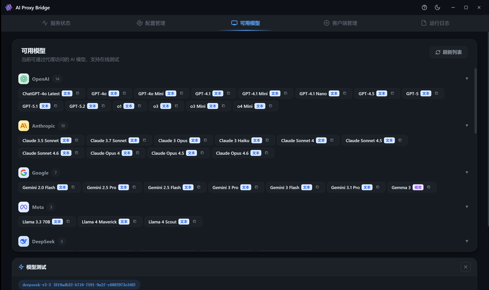

# AI Proxy Bridge

[](LICENSE)
[]()

Free access to top-tier AI models (Claude, GPT-4/5, Gemini, DeepSeek, Llama, etc.) through a local OpenAI-compatible API proxy.

Бесплатный доступ к топовым моделям ИИ (Claude, GPT-4/5, Gemini, DeepSeek, Llama и др.) через локальный OpenAI-совместимый API-прокси.

---



## Features | Возможности

- **OpenAI API Compatible | Совместимость с OpenAI API** — Drop-in replacement for any client that supports OpenAI API format (streaming + non-streaming) | Готовая замена для любого клиента, поддерживающего формат OpenAI API (потоковый и обычный режимы)
- **Dual Connection Modes | Два режима подключения** — Tampermonkey WebSocket client (recommended) or Puppeteer browser automation | WebSocket-клиент Tampermonkey (рекомендуется) или автоматизация браузера через Puppeteer
- **300+ Models | Более 300 моделей** — Automatically extracts model list from LMArena, grouped by provider (OpenAI, Anthropic, Google, Meta, DeepSeek, Mistral, etc.) | Автоматическое получение списка моделей с LMArena, сгруппированных по провайдерам (OpenAI, Anthropic, Google, Meta, DeepSeek, Mistral и др.)
- **Model Test Panel | Панель тестирования моделей** — Test any model directly from the app with real-time streaming response | Тестируйте любую модель прямо из приложения с потоковым ответом в реальном времени
- **Multi-Instance Load Balancing | Балансировка нагрузки между инстансами** — Run multiple browser sessions with round-robin request distribution | Запускайте несколько браузерных сессий с распределением запросов по принципу round-robin
- **Cross-Platform | Кроссплатформенность** — Windows, macOS, Linux support via Electron | Поддержка Windows, macOS и Linux благодаря Electron
- **Dark/Light Theme | Тёмная/светлая тема** — Modern UI with provider logos and capability tags | Современный интерфейс с логотипами провайдеров и тегами возможностей
- **Real-time Logs | Логи в реальном времени** — Built-in log viewer for debugging | Встроенный просмотрщик логов для отладки

---

## Architecture | Архитектура

```
┌─────────────────┐     ┌──────────────────────────────────────┐     ┌──────────────────┐
│  AI Client      │────▶│  AI Proxy Bridge (Electron App)      │────▶│  lmarena.ai      │
│  (Cherry Studio │     │                                      │     │  (Browser Page)  │
│   / VS Code /   │     │  ┌──────────────────────────────┐   │     │                  │
│   Any OpenAI    │     │  │  Proxy Server (Express + WS) │   │     │  ┌────────────┐  │
│   Client)       │◀────│  │  :61001                      │◀───│─────│  │ Tampermonkey│  │
│                 │     │  └──────────────────────────────┘   │     │  │ Userscript  │  │
└─────────────────┘     │                                      │     │  └────────────┘  │
                        │  ┌──────────────────────────────┐   │     │                  │
                        │  │  Browser Manager (Puppeteer) │───│────▶│  ┌────────────┐  │
                        │  └──────────────────────────────┘   │     │  │ Chrome/Edge │  │
                        └──────────────────────────────────────┘     │  └────────────┘  │
                                                                    └──────────────────┘
```

### How It Works | Как это работает

1. The app runs a local HTTP+WebSocket server on port `61001` | Приложение запускает локальный HTTP+WebSocket сервер на порту `61001`
2. A Tampermonkey userscript in your browser connects via WebSocket | Юзерскрипт Tampermonkey в вашем браузере подключается по WebSocket
3. When an AI client sends a request to the local API, the proxy forwards it to the userscript | Когда ИИ-клиент отправляет запрос к локальному API, прокси пересылает его юзерскрипту
4. The userscript hijacks the page's own `fetch` request to LMArena, replacing the model ID and message content | Юзерскрипт перехватывает собственный `fetch`-запрос страницы к LMArena, подменяя ID модели и содержимое сообщения
5. The response is streamed back through the proxy in OpenAI-compatible format | Ответ передаётся обратно через прокси в OpenAI-совместимом формате

---

## Quick Start | Быстрый старт

### 1. Install | Установка

Download from [Releases](https://github.com/Vogadero/AIProxyBridge/releases): | Скачайте из [Releases](https://github.com/Vogadero/AIProxyBridge/releases):

| OS | File | Файл |
|---|---|---|
| Windows | `AI-Proxy-Bridge-Setup.exe` | `AI-Proxy-Bridge-Setup.exe` |
| macOS | `AI-Proxy-Bridge.dmg` | `AI-Proxy-Bridge.dmg` |
| Linux | `AI-Proxy-Bridge.AppImage` | `AI-Proxy-Bridge.AppImage` |

Or build from source: | Или соберите из исходников:

```bash
git clone https://github.com/Vogadero/AIProxyBridge.git
cd AIProxyBridge
npm install
npm run dev
```

### 2. Start Service | Запуск сервиса

Launch the app and click "Start Service" | Запустите приложение и нажмите «Start Service»

### 3. Connect Browser | Подключение браузера

**Recommended: Tampermonkey Userscript | Рекомендуется: юзерскрипт Tampermonkey** (recommended mode | рекомендуемый режим)

1. Install [Tampermonkey](https://www.tampermonkey.net/) extension in your browser | Установите расширение [Tampermonkey](https://www.tampermonkey.net/) в ваш браузер
2. Create a new script and paste the contents of [`scripts/bridge-userscript.js`](scripts/bridge-userscript.js) | Создайте новый скрипт и вставьте содержимое файла [`scripts/bridge-userscript.js`](scripts/bridge-userscript.js)
3. Open [lmarena.ai](https://lmarena.ai) and log in with Google | Откройте [lmarena.ai](https://lmarena.ai) и войдите через Google
4. The page title will show a checkmark when connected | При успешном подключении в заголовке страницы появится галочка

**Alternative: Puppeteer Browser | Альтернатива: браузер Puppeteer**

1. Click "New Instance" in the "Browser Instances" tab | Нажмите «New Instance» на вкладке «Browser Instances»
2. Log in with Google in the new browser window | Войдите через Google в новом окне браузера
3. Send one message to verify the connection | Отправьте одно сообщение, чтобы проверить подключение

### 4. Configure Client | Настройка клиента

In any OpenAI API compatible client: | В любом клиенте, совместимом с OpenAI API:

| Setting | Настройка | Value | Значение |
|---|---|---|---|
| API Base URL | Базовый URL API | `http://127.0.0.1:61001` | `http://127.0.0.1:61001` |
| API Key | Ключ API | `123456` | `123456` |
| Model | Модель | Any model from the list (e.g., `claude-3-5-sonnet-20241022`) | Любая модель из списка (например, `claude-3-5-sonnet-20241022`) |

### Supported Clients | Поддерживаемые клиенты

- [Cherry Studio](https://www.cherry-ai.com/) — AI chat client | ИИ-чат клиент
- [Continue](https://continue.dev/) — VS Code / JetBrains AI coding assistant | ИИ-ассистент программиста для VS Code / JetBrains
- [Kilo Code](https://kilocode.ai/) — VS Code AI coding plugin | ИИ-плагин для программирования в VS Code
- [Immersive Translate](https://immersivetranslate.com/) — Browser translation extension | Расширение для перевода в браузере
- Any client that supports OpenAI API format | Любой клиент с поддержкой формата OpenAI API

---

## API Endpoints | API-эндпоинты

| Endpoint | Эндпоинт | Method | Метод | Description | Описание |
|---|---|---|---|---|---|
| `/v1/models` | `/v1/models` | GET | GET | List available models (OpenAI format) | Список доступных моделей (формат OpenAI) |
| `/v1/chat/completions` | `/v1/chat/completions` | POST | POST | Chat completion (streaming + non-streaming) | Генерация ответа в чате (потоковая и обычная) |
| `/health` | `/health` | GET | GET | Health check | Проверка работоспособности |

Example request: | Пример запроса:

```bash
curl http://127.0.0.1:61001/v1/chat/completions \
  -H "Authorization: Bearer 123456" \
  -H "Content-Type: application/json" \
  -d '{
    "model": "claude-3-5-sonnet-20241022",
    "messages": [{"role": "user", "content": "Hello!"}],
    "stream": true
  }'
```

---

## Development | Разработка

### Prerequisites | Требования

- Node.js 20+
- npm

### Commands | Команды

```bash
npm install          # Install dependencies | Установить зависимости
npm run dev          # Run in development mode | Запуск в режиме разработки
npm run build        # Build for current platform | Сборка для текущей платформы
npm run build:win    # Build for Windows | Сборка для Windows
npm run build:mac    # Build for macOS | Сборка для macOS
npm run build:linux  # Build for Linux | Сборка для Linux
```

### Project Structure | Структура проекта

```
AIProxyBridge/
├── main.js                 # Electron main process | Главный процесс Electron
├── preload.js              # IPC bridge (renderer ↔ main) | IPC-мост (renderer ↔ main)
├── renderer/
│   ├── index.html          # UI (5-tab SPA) | Интерфейс (SPA из 5 вкладок)
│   ├── renderer.js         # UI logic | Логика интерфейса
│   └── styles.css          # Styles | Стили
├── src/
│   ├── proxy-server.js     # Express + WebSocket proxy server | Прокси-сервер Express + WebSocket
│   └── browser-manager.js  # Puppeteer browser automation | Автоматизация браузера Puppeteer
├── scripts/
│   └── bridge-userscript.js # Tampermonkey userscript | Юзерскрипт Tampermonkey
└── package.json
```

---

## FAQ | Частые вопросы

**Model list is empty? | Список моделей пуст?**
> Make sure the service is running and a browser client is connected. Click "Refresh List". | Убедитесь, что сервис запущен и браузерный клиент подключён. Нажмите «Refresh List».

**No API response? | API не отвечает?**
> Check if the browser page is still on lmarena.ai and the title shows a checkmark. | Проверьте, что страница браузера всё ещё открыта на lmarena.ai и в заголовке отображается галочка.

**429 Rate Limit Error? | Ошибка 429 (превышение лимита запросов)?**
> This is reCAPTCHA verification. Try sending a message manually in the browser first, then retry. | Это проверка reCAPTCHA. Сначала отправьте сообщение вручную в браузере, затем повторите попытку.

---

## License | Лицензия

[MIT License](LICENSE)

---

## Disclaimer | Отказ от ответственности

This project is for educational and research purposes only. Use of this tool to access AI services may violate the terms of service of the platforms involved. The user assumes all responsibility for any consequences arising from the use of this tool.

Данный проект предназначен исключительно для образовательных и исследовательских целей. Использование этого инструмента для доступа к сервисам ИИ может нарушать условия использования соответствующих платформ. Пользователь несёт полную ответственность за любые последствия, возникающие в результате использования данного инструмента.
